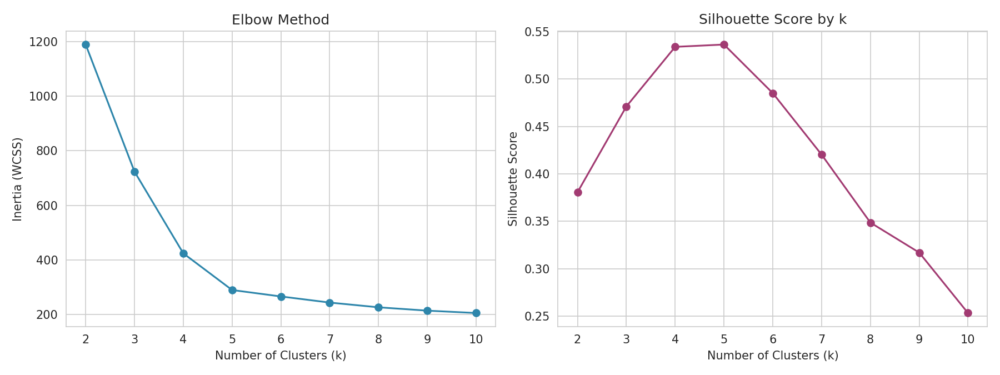
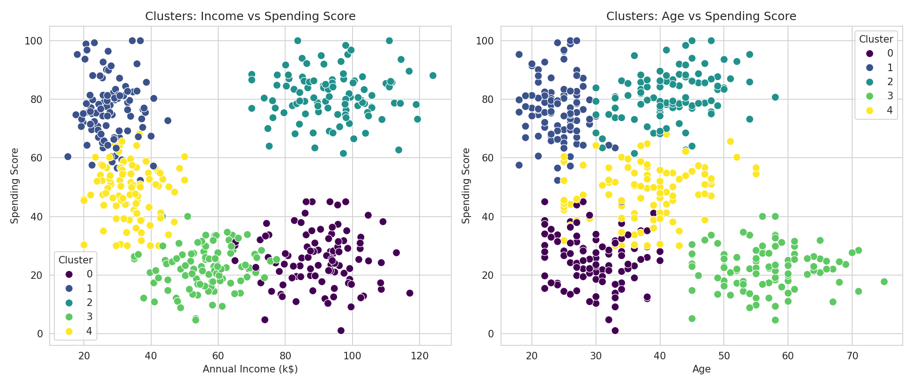

# Customer Segmentation using K-Means Clustering

An end-to-end unsupervised machine learning pipeline that segments retail
customers into distinct behavioral groups using K-Means clustering, then
translates each cluster into an actionable business persona.

## Overview

Businesses rarely treat every customer the same way — a 24-year-old high
spender on a modest income needs a different marketing approach than a
55-year-old high-income customer who rarely spends. This project builds a
reproducible pipeline that:

1. Cleans and validates raw customer records
2. Scales features so no single variable (e.g. income) dominates distance
   calculations
3. Selects the optimal number of clusters using the **elbow method** and
   **silhouette score**
4. Fits a final K-Means model and visualizes the resulting segments
5. Converts cluster centroids into human-readable business personas

## Tech Stack

`Python` · `Pandas` · `NumPy` · `Scikit-learn` · `Matplotlib` · `Seaborn`

## Project Structure

```
customer-segmentation-kmeans/
├── data/
│   └── customer_data.csv          # generated dataset
├── src/
│   ├── generate_data.py           # synthetic customer data generator
│   ├── preprocessing.py           # cleaning + feature scaling
│   ├── clustering.py              # elbow/silhouette model selection + fitting
│   └── pipeline.py                # orchestrates the full run
├── notebooks/
│   └── analysis.ipynb             # exploratory, narrative version
├── results/                       # generated plots + CSV outputs
├── requirements.txt
└── README.md
```

## How to Run

```bash
git clone https://github.com/<your-username>/customer-segmentation-kmeans.git
cd customer-segmentation-kmeans
pip install -r requirements.txt

python src/generate_data.py      # creates data/customer_data.csv
cd src
python pipeline.py               # runs the full pipeline, writes results/
```

## Methodology

**Feature engineering & scaling** — `Age`, `Annual_Income_k`,
`Spending_Score`, and `Annual_Purchases` are standardized with
`StandardScaler` so K-Means' Euclidean distance isn't skewed by income
being on a much larger numeric scale than the other fields.

**Choosing k** — rather than picking a cluster count arbitrarily, the
pipeline sweeps k = 2–10 and evaluates both:
- **Inertia (elbow method)** — within-cluster sum of squares
- **Silhouette score** — how well-separated and cohesive each cluster is



The k with the highest silhouette score is selected automatically.

**Cluster visualization** — final segments plotted across the two most
business-relevant feature pairs:



## Results

On the generated dataset, the model selects **k = 5** with a silhouette
score of **0.54**, recovering five clearly separated customer segments:

| Cluster | Age | Income (k$) | Spending Score | Segment |
|---|---|---|---|---|
| 0 | ~30 | High | Low | Young professionals, cautious spenders |
| 1 | ~24 | Low/Mid | High | Young, impulsive spenders |
| 2 | ~42 | High | High | Premium customers — highest value |
| 3 | ~57 | High | Low | Older, conservative savers |
| 4 | ~38 | Low/Mid | High | Budget-conscious regulars |

Full numeric centroids are written to `results/cluster_summary.csv`.

## Business Application

These personas can directly inform:
- **Targeted marketing** — premium campaigns for Cluster 2, value/loyalty
  offers for Cluster 3
- **Retention strategy** — identifying which segments are under-engaged
  relative to their income potential (Cluster 0)
- **Customer lifetime value modeling** — prioritizing acquisition spend
  toward segments that resemble Cluster 2

## Future Improvements

- Swap in a real dataset (e.g. UCI Online Retail) via the same
  `preprocessing.py` interface
- Add PCA for 2D visualization when using more than 2–3 features
- Compare K-Means against DBSCAN / Gaussian Mixture Models
- Deploy as a small Streamlit app for interactive segment exploration
